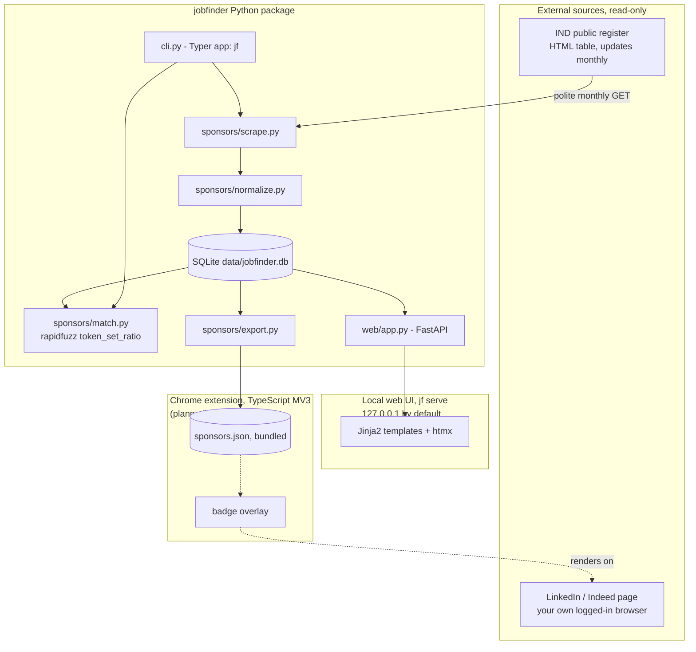

# JobFinder

Personal job-search tool for the Dutch market. Working name - will be
renamed later.

Cross-references companies and job postings against the IND public
register of recognised sponsors, so it's immediately clear which employers
can sponsor a work-permit / highly-skilled-migrant visa. Also parses resumes
and matches jobs by keyword, experience level, and country. NL-only for now.

## Architecture

Python owns scraping, matching, and the backend; a CLI and a local web UI
both sit on the same code. A Chrome extension (TypeScript, planned) will be
the only other language. SQLite for storage - single user, zero ops. Full
writeup, including the hosting decision and risk posture: [docs/architecture.md](docs/architecture.md).



**Stack:**

| Layer | Choice | Why |
| --- | --- | --- |
| Backend / scraping / matching | Python (`httpx`, `beautifulsoup4`, `rapidfuzz`) | Mature ecosystem for all of it; one language for the whole backend |
| CLI | Typer | Fast to build, matches other personal tools in this setup |
| Web UI | FastAPI + Jinja2 + htmx | Same language as the backend, no second frontend toolchain for a single-user tool; htmx gives live search without hand-written JS |
| Browser extension (planned) | TypeScript, Manifest V3 | Only option for a Chrome extension |
| Storage | SQLite, WAL mode | Single user, ~13k rows, zero ops |
| Hosting | Local-first (`127.0.0.1` by default) | Nothing here needs to be always-on or public; see [docs/architecture.md](docs/architecture.md#hosting) for remote-access options when actually needed |

## Quick start

```bash
uv sync
uv run jf sync-sponsors
uv run jf match --company "Booking.com"
uv run jf serve          # web UI at http://127.0.0.1:8000
```

## Development

```bash
uv run pytest
uv run ruff check .
uv run ruff format .
uv run mypy src
```

## Status

Sponsor registry sync, fuzzy company matching, the CLI, and the local web
UI are working. Resume parsing, the Chrome extension, and broader job
matching are not built yet - see [docs/architecture.md](docs/architecture.md)
for the roadmap.
