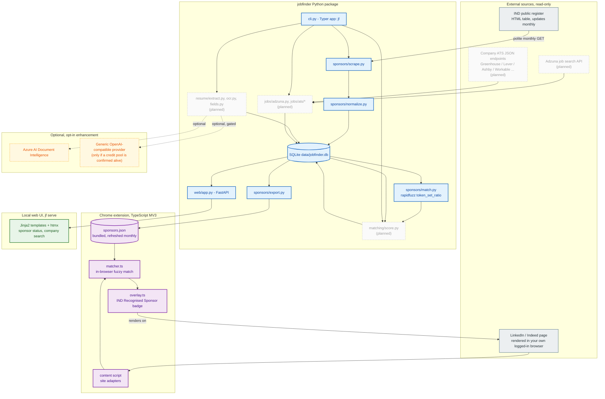
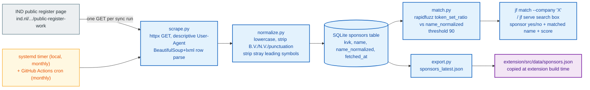

# JobFinder

Personal job-search tool for the Dutch market. Working name - will be
renamed later.

Cross-references companies and job postings against the IND public
register of recognised sponsors, so it's immediately clear which employers
can sponsor a work-permit / highly-skilled-migrant visa. Also parses resumes
and matches jobs by keyword, experience level, and country. NL-only for now.

## Architecture

Python owns scraping, matching, resume parsing, and both the CLI and the
local web UI - they're two views over the same backend code, not separate
stacks. TypeScript owns the Chrome extension (Manifest V3), the only other
language in the project. SQLite for storage: single user, trivial data
volume, zero ops.



Blue = built, purple = the Chrome extension (built), green = the web UI
(built), amber dashed = optional opt-in enhancement, gray dashed = planned
but not built yet.

### Sponsor registry sync

The core differentiator's data pipeline - scrape, normalize, store, and
fan out to every consumer (CLI, web UI, extension):



The IND page has been seen listing the same KVK number twice; the upsert
(`ON CONFLICT(kvk) DO UPDATE`) collapses that to one row, so the reported
sync count is distinct sponsors stored, not raw rows parsed. The matcher
also used to use rapidfuzz's `WRatio` scorer, which turned out to give a
false-positive ~90/100 "match" to almost any short query against a long,
unrelated company name (verified live - it degrades to
`partial_ratio * 0.9`). Switched to `token_set_ratio`, which separates
real matches (90-100) from unrelated pairs (stayed at or below 57 across
every adversarial case tried, both in the Python matcher and its
TypeScript port in the extension).

### Stack

| Layer | Choice | Why |
| --- | --- | --- |
| Backend / scraping / matching | Python (`httpx`, `beautifulsoup4`, `rapidfuzz`) | Mature ecosystem for all of it; one language for the whole backend |
| CLI | Typer | Fast to build, matches other personal tools in this setup |
| Web UI | FastAPI + Jinja2 + htmx | Same language as the backend, no second frontend toolchain for a single-user tool; htmx gives live search without hand-written JS |
| Browser extension | TypeScript, Vite + CRXJS, Manifest V3 | Only option for a Chrome extension; bundled sponsor snapshot + in-browser matching, no runtime network calls |
| Storage | SQLite, WAL mode | Single user, ~13k rows, zero ops |
| Hosting | Local-first (`127.0.0.1` by default) | Nothing here needs to be always-on or public, see Hosting below |

### Hosting

Runs local-first by default: `jf serve` binds `127.0.0.1` only, so it's
reachable from this machine and nowhere else unless you change `--host`.
That's a deliberate default, not a placeholder - nothing here needs to be
always-on or public, and keeping it local-only is the simplest way to avoid
exposing a personal tool (eventually holding resume PII) to the network.

If/when remote access is wanted:

- **Private access from your other devices (phone, laptop elsewhere)**:
  [Tailscale](https://tailscale.com) (or `cloudflared tunnel`) in front of
  `jf serve`. Free for personal use, keeps the tool off the public internet
  entirely, no code changes needed. The recommended next step if "host it"
  just means "reach it from somewhere other than this machine."
- **Actually public / shareable with others**: a small always-on host -
  [Fly.io](https://fly.io)'s free tier is the lowest-friction, vendor-
  neutral option for a single small FastAPI container. Azure Container
  Apps (consumption plan, scale-to-zero) is the alternative if the Azure
  portfolio angle matters more than cost - GitHub Student Pack / Azure for
  Students benefits may have lapsed post-graduation, so check before
  assuming that credit is available.

Neither of these is provisioned - this is guidance for when the decision
is actually needed, not an implemented default.

### Risk / legal posture

| Posture | Risk | Guardrail |
| --- | --- | --- |
| IND register scraping | Low - government register published for exactly this lookup purpose; robots.txt allows it; no reuse restriction found | One GET per monthly sync, descriptive User-Agent, abort loudly if row count craters or parsing yields zero rows |
| LinkedIn/Indeed server-side bulk scraping | High - ToS risk, bot-detection fragility, risk to the account doing it | Avoid entirely. Future job ingestion uses Adzuna's API and direct ATS JSON endpoints instead |
| Chrome extension badge overlay | Materially lower - reads only the page already rendered in an authenticated session, same category as an ad blocker | Stays client-side only, no server-side fetch of LinkedIn/Indeed pages. The LinkedIn/Indeed CSS selectors are therefore best-effort, never checked against a live session - see `extension/README.md` |
| Resume content (PII) | N/A for local-only parsing | Any third-party parsing tier is opt-in only, never default |
| Web UI reachability | N/A while local-only | Defaults to `127.0.0.1`; opening it up is an explicit `--host` choice |

### Roadmap

1. **Sponsor registry sync + fuzzy match** (done) - zero external API dependency, the actual differentiator.
2. **CLI + local web UI** (done) - `jf` commands and `jf serve` (FastAPI + Jinja2 + htmx), both backed by the same matching code.
3. **Chrome extension badge overlay** (done) - Vite + CRXJS + TypeScript MV3, bundled sponsor snapshot, in-browser `token_set_ratio` port. Verified end-to-end in real Chrome against a simulated LinkedIn navigation.
4. **Resume OCR + structured extraction** (next) - local-first (pdfplumber/pytesseract), optional opt-in cloud tiers.
5. **Broader job ingestion + open-application tracking** - legitimate APIs/ATS endpoints only, never bulk LinkedIn/Indeed scraping.

Deeper reasoning and the hackathon-credential/job-research research behind
these decisions: `~/.claude/plans/zippy-pondering-scroll.md` (local
planning notes, not in the repo).

## Quick start

```bash
uv sync
uv run jf sync-sponsors
uv run jf match --company "Booking.com"
uv run jf serve          # web UI at http://127.0.0.1:8000
```

Chrome extension: see [extension/README.md](extension/README.md).

## Development

```bash
uv run pytest
uv run ruff check .
uv run ruff format .
uv run mypy src
```

## Status

Sponsor registry sync, fuzzy company matching, the CLI, the local web UI,
and the Chrome extension are working. Resume parsing and broader job
matching are not built yet.
