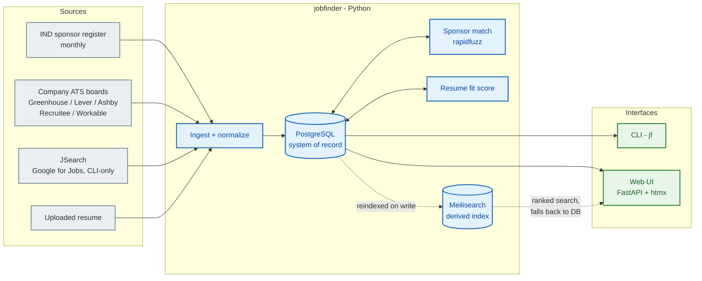
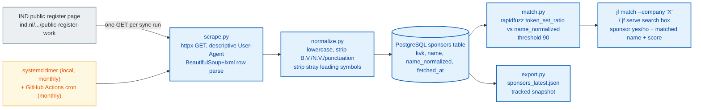

# JobFinder


[](LICENSE)

[](https://github.com/adam-bouafia)
[](https://www.linkedin.com/in/adam-bouafia)
[](https://adam-bouafia.github.io)

A job search tool for the Dutch market. Cross-references companies and
job postings against the IND public register of recognised sponsors, so
it's immediately clear which employers can sponsor a work-permit or
highly-skilled-migrant visa. Also parses resumes and scores jobs by fit,
keyword, experience level, and location.

NL-only for now. One Python backend behind two interfaces: a CLI and a
local web UI.

## Architecture

Python owns everything - scraping, matching, resume parsing, the CLI, and
the web UI are all one codebase, not separate stacks. PostgreSQL (Neon)
is the system of record; Meilisearch is a derived, rebuildable search
index on top of it, never the source of truth.

Four sources feed one ingest pipeline into Postgres. Both interfaces read
from Postgres, the web UI additionally through Meilisearch for ranked
search:



Grey = external source, blue = the core pipeline and storage, green = a
user-facing interface. Two optional, opt-in enhancements aren't in the
diagram since they're off by default: Azure AI Document Intelligence and
a generic OpenAI-compatible provider, both only for resume parsing.

### Sponsor registry sync

The core differentiator's data pipeline - scrape, normalize, store, and
fan out to every consumer (CLI, web UI):



The IND page has been seen listing the same KVK number twice; the upsert
(`ON CONFLICT(kvk) DO UPDATE`) collapses that to one row, so the reported
sync count is distinct sponsors stored, not raw rows parsed. The matcher
also used to use rapidfuzz's `WRatio` scorer, which turned out to give a
false-positive ~90/100 "match" to almost any short query against a long,
unrelated company name (verified live - it degrades to
`partial_ratio * 0.9`). Switched to `token_set_ratio`, which separates
real matches (90-100) from unrelated pairs (stayed at or below 57 across
every adversarial case tried).

### Stack

| Layer | Choice | Details |
| --- | --- | --- |
| Language | Python 3.12, one codebase | Scraping, matching, resume parsing, the CLI, and the web UI are all the same backend - no second language, no logic duplicated between interfaces |
| HTTP / scraping | `httpx` + `beautifulsoup4` + `lxml` | `httpx` for a modern client with async support if the pipeline ever needs it; `lxml` as BeautifulSoup's parser backend for speed over the stdlib parser |
| Fuzzy matching | `rapidfuzz`, `token_set_ratio`, threshold 90 | Compares word sets rather than raw strings, so an informal name like "ASML" matches "ASML Netherlands B.V." (scores 100) while unrelated names stay under 60 - replaced `WRatio`, which gave false positives on short-vs-long name pairs (see Sponsor registry sync above) |
| Resume parsing | `pdfplumber` (text layer), `pytesseract` + `pdf2image` (OCR fallback) | Local-first, no LLM call and no persona-biased keyword list; OCR needs the `tesseract` system binary installed separately, not just a pip package |
| Job ingestion | Direct ATS JSON APIs (Greenhouse, Lever, Ashby, Recruitee, Workable) + JSearch (RapidAPI, CLI-only) | ATS endpoints need no auth and link straight to the employer's own posting; JSearch aggregates Google for Jobs but is filtered to keep only results whose apply-link domain actually matches the employer name - never bulk LinkedIn/Indeed scraping |
| CLI | [Typer](https://typer.tiangolo.com) | Commands are plain type-hinted Python functions - arguments, options, and `--help` text all come from the function signature, nothing hand-registered separately |
| Web UI | FastAPI + Jinja2 + [htmx](https://htmx.org) | Same language and functions as the CLI, so the UI is a thin layer, not a parallel implementation; htmx gives live search-as-you-type over server-rendered HTML with no JS build step or frontend framework |
| Storage | PostgreSQL via [Neon](https://neon.tech) (free serverless tier, scale-to-zero) | A real `DATABASE_URL` any deployment can reach without standing up and operating a database server by hand |
| Search | [Meilisearch](https://www.meilisearch.com), self-hosted on Modal | Typo-tolerant, ranked search over the jobs table - a derived, rebuildable index, never the source of truth; the web UI falls back to a plain Postgres query if it's ever down |
| Hosting | Local-first by default (`jf serve`, `127.0.0.1`), optionally deployed on [Modal](https://modal.com) | See Hosting below for the current state |

### Hosting

`jf serve` binds `127.0.0.1` by default for purely local use - nothing
about that has changed. The app can also run on [Modal](https://modal.com)
(see `deploy/`) - Postgres via Neon, search via self-hosted Meilisearch,
full setup in `deploy/README.md`. **Currently paused**: the deployed
instance is stopped and `deploy-modal.yml`'s auto-deploy-on-push is
turned off (both to stop billing while the repo sits idle) - redeploy
with `uv run modal deploy deploy/modal_app.py` or by re-enabling the
workflow's push trigger.

### Risk / legal posture

| Posture | Risk | Guardrail |
| --- | --- | --- |
| IND register scraping | Low - government register published for exactly this lookup purpose; robots.txt allows it; no reuse restriction found | One GET per monthly sync, descriptive User-Agent, abort loudly if row count craters or parsing yields zero rows |
| LinkedIn/Indeed server-side bulk scraping | High - ToS risk, bot-detection fragility, risk to the account doing it | Avoided entirely - job ingestion uses direct ATS JSON endpoints instead, verified live against a real company's public Greenhouse board |
| Job aggregator APIs | Adzuna's terms require a visible "Jobs by Adzuna" badge, which conflicts with a clean, direct-to-employer open-source product - tried, then dropped | JSearch (RapidAPI) checked instead: no attribution-badge requirement, commercial use explicitly licensed - but its own "is this link direct" flag turned out not to mean "employer's own domain" (verified live), so results are filtered by apply-link-domain-vs-employer-name match instead, CLI-only given its 200 req/month free tier |
| Resume content (PII) | N/A for local-only parsing | Any third-party parsing tier is opt-in only, never default |
| Web UI reachability | N/A while local-only | Defaults to `127.0.0.1`; opening it up is an explicit `--host` choice |

### What's built

- **Sponsor registry sync + fuzzy match** - the core differentiator, zero external API dependency.
- **CLI + local web UI** - `jf` commands and `jf serve` (FastAPI + Jinja2 + htmx), both backed by the same matching code.
- **Resume OCR + structured extraction** - `pdfplumber` text layer with a per-page `pytesseract`/`pdf2image` OCR fallback, heuristic skills/experience/education extraction, no LLM call.
- **Job ingestion + open-application tracking + resume-derived scoring** - direct ATS JSON APIs plus JSearch (CLI-only, filtered to direct-domain results), enriched with sponsor status and an open-application flag at ingest time, scored against the loaded resume's skills.
- **PostgreSQL storage + Meilisearch search index** - see Stack above.

Explicitly not built, by design: automatic discovery of which sponsor
uses which ATS/slug (a search-engine-based approach was considered and
rejected as too fragile - pass a known `--slug` instead), and direct
LinkedIn/Indeed server-side scraping (considered and rejected as the same
ToS-risk category as Adzuna, worse - see Risk posture above).

## Quick start

```bash
uv sync
uv run jf sync-sponsors
uv run jf match --company "Booking.com"
uv run jf serve                                 # web UI at http://127.0.0.1:8000
uv run jf parse-resume path/to/resume.pdf        # OCR fallback needs tesseract installed
uv run jf fetch-jobs --source greenhouse --slug stripe
uv run jf search-jobs --query "platform engineer"   # needs a RapidAPI key, see .env
uv run jf rescore-jobs
uv run jf list-jobs --sponsors-only
```

## Development

```bash
uv run pytest
uv run ruff check .
uv run ruff format .
uv run mypy src
```

## License

[MIT](LICENSE).
