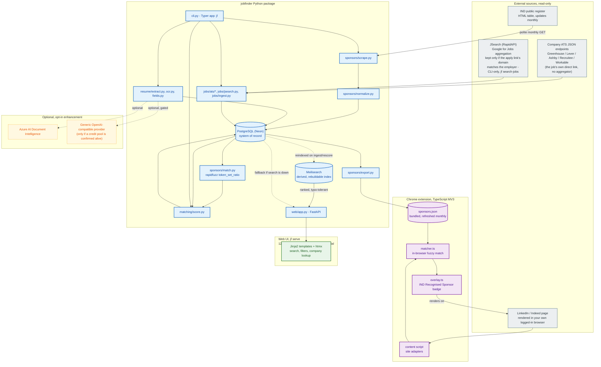
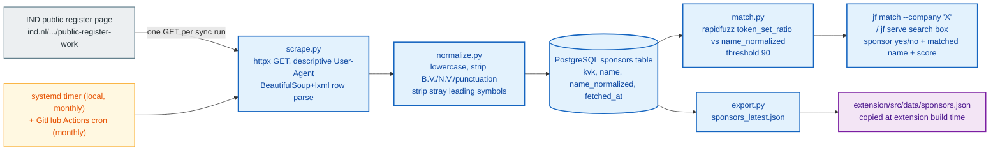

# JobFinder


[](https://github.com/adam-bouafia)
[](https://www.linkedin.com/in/adam-bouafia)
[](https://adam-bouafia.github.io)

Personal job-search tool for the Dutch market. Working name - will be
renamed later.

Cross-references companies and job postings against the IND public
register of recognised sponsors, so it's immediately clear which employers
can sponsor a work-permit / highly-skilled-migrant visa. Also parses resumes
and matches jobs by keyword, experience level, and country. NL-only for now.

## Architecture

Python owns scraping, matching, resume parsing, and both the CLI and the
local web UI - they're two views over the same backend code, not separate
stacks. TypeScript owns the Chrome extension (Manifest V3), the only other
language in the project. PostgreSQL (Neon, free serverless tier) is the
system of record; Meilisearch (self-hosted on Modal) is a derived,
rebuildable search index on top of it, never the source of truth.



Blue = built (the whole core package, every phase), purple = the Chrome
extension (built), green = the web UI (built), gray = an external source
JobFinder reads from, amber dashed = optional opt-in enhancement (the only
pieces still off by default).

### Sponsor registry sync

The core differentiator's data pipeline - scrape, normalize, store, and
fan out to every consumer (CLI, web UI, extension):



The IND page has been seen listing the same KVK number twice; the upsert
(`ON CONFLICT(kvk) DO UPDATE`) collapses that to one row, so the reported
sync count is distinct sponsors stored, not raw rows parsed. The matcher
also used to use rapidfuzz's `WRatio` scorer, which turned out to give a
false-positive ~90/100 "match" to almost any short query against a long,
unrelated company name (verified live - it degrades to
`partial_ratio * 0.9`). Switched to `token_set_ratio`, which separates
real matches (90-100) from unrelated pairs (stayed at or below 57 across
every adversarial case tried, both in the Python matcher and its
TypeScript port in the extension).

### Stack

| Layer | Choice | Why |
| --- | --- | --- |
| Backend / scraping / matching | Python (`httpx`, `beautifulsoup4`, `rapidfuzz`) | Mature ecosystem for all of it; one language for the whole backend |
| Resume parsing | `pdfplumber` (text layer), `pytesseract` + `pdf2image` (OCR fallback) | Local-first; OCR needs the `tesseract` system binary, not just a pip package |
| Job ingestion | Direct ATS JSON APIs (Greenhouse/Lever/Ashby/Recruitee/Workable), plus JSearch (RapidAPI, CLI-only) | ATS APIs need no auth and are always direct; JSearch aggregates Google for Jobs but is filtered to keep only results whose apply link's domain actually matches the employer - never bulk LinkedIn/Indeed scraping |
| CLI | Typer | Fast to build, matches other personal tools in this setup |
| Web UI | FastAPI + Jinja2 + htmx | Same language as the backend, no second frontend toolchain for a single-user tool; htmx gives live search without hand-written JS |
| Browser extension | TypeScript, Vite + CRXJS, Manifest V3 | Only option for a Chrome extension; bundled sponsor snapshot + in-browser matching, no runtime network calls |
| Storage | PostgreSQL (Neon, free serverless tier) | A real `DATABASE_URL` any deployment can reach, without hand-running a database server |
| Search | Meilisearch, self-hosted on Modal | Typo-tolerant, ranked search over the jobs table - derived/rebuildable from Postgres, never the source of truth; falls back to a plain Postgres query if it's ever down |
| Hosting | Local-first by default, also deployed on Modal | See Hosting below |

### Hosting

`jf serve` binds `127.0.0.1` by default for purely local use - nothing
about that has changed. The app can also run on [Modal](https://modal.com)
(see `deploy/`) - Postgres via Neon, search via self-hosted Meilisearch,
full setup in `deploy/README.md`. **Currently paused**: the deployed
instance is stopped and `deploy-modal.yml`'s auto-deploy-on-push is
disabled (both to stop billing while the repo sits idle) - redeploy with
`uv run modal deploy deploy/modal_app.py` or by re-enabling the workflow's
push trigger.

### Risk / legal posture

| Posture | Risk | Guardrail |
| --- | --- | --- |
| IND register scraping | Low - government register published for exactly this lookup purpose; robots.txt allows it; no reuse restriction found | One GET per monthly sync, descriptive User-Agent, abort loudly if row count craters or parsing yields zero rows |
| LinkedIn/Indeed server-side bulk scraping | High - ToS risk, bot-detection fragility, risk to the account doing it | Avoided entirely - job ingestion uses direct ATS JSON endpoints instead, verified live against a real company's public Greenhouse board |
| Job aggregator APIs | Adzuna's terms require a visible "Jobs by Adzuna" badge, which conflicts with a clean, direct-to-employer open-source product - tried, then dropped | JSearch (RapidAPI) checked instead: no attribution-badge requirement, commercial use explicitly licensed - but its own "is this link direct" flag turned out not to mean "employer's own domain" (verified live), so results are filtered by apply-link-domain-vs-employer-name match instead, CLI-only given its 200 req/month free tier |
| Chrome extension badge overlay | Materially lower - reads only the page already rendered in an authenticated session, same category as an ad blocker | Stays client-side only, no server-side fetch of LinkedIn/Indeed pages. The LinkedIn/Indeed CSS selectors are therefore best-effort, never checked against a live session - see `extension/README.md` |
| Resume content (PII) | N/A for local-only parsing | Any third-party parsing tier is opt-in only, never default |
| Web UI reachability | N/A while local-only | Defaults to `127.0.0.1`; opening it up is an explicit `--host` choice |

### Roadmap

All five phases from the original plan are built:

1. **Sponsor registry sync + fuzzy match** - zero external API dependency, the actual differentiator.
2. **CLI + local web UI** - `jf` commands and `jf serve` (FastAPI + Jinja2 + htmx), both backed by the same matching code.
3. **Chrome extension badge overlay** - Vite + CRXJS + TypeScript MV3, bundled sponsor snapshot, in-browser `token_set_ratio` port. Verified end-to-end in real Chrome against a simulated LinkedIn navigation.
4. **Resume OCR + structured extraction** - `pdfplumber` text layer with a per-page `pytesseract`/`pdf2image` OCR fallback, heuristic skills/experience/education extraction, no LLM call. OCR needs the `tesseract` system binary installed separately.
5. **Job ingestion + open-application tracking + resume-derived scoring** - direct ATS JSON APIs (Greenhouse/Lever/Ashby/Recruitee/Workable) plus JSearch (CLI-only, filtered to direct-domain results), enriched with sponsor status and an open-application flag at ingest time, scored against the loaded resume's skills.

Past the original five, two more have landed: **storage migrated from
SQLite to PostgreSQL** (Neon), and a **Meilisearch search index** was
added on top of it for ranked, typo-tolerant search - both deployed
alongside the app on Modal (see `deploy/README.md`).

What's explicitly NOT built, by design: automatic discovery of which
sponsor uses which ATS/slug (job-research's DuckDuckGo-based approach was
deliberately not repeated here - pass a known `--slug` instead), direct
LinkedIn/Indeed server-side scraping (considered and rejected as the same
ToS-risk category as Adzuna, worse), and any LinkedIn/Indeed-selector
verification beyond best-effort (see `extension/README.md`).

Deeper reasoning and the hackathon-credential/job-research research behind
these decisions: `~/.claude/plans/zippy-pondering-scroll.md` (local
planning notes, not in the repo).

## Quick start

```bash
uv sync
uv run jf sync-sponsors
uv run jf match --company "Booking.com"
uv run jf serve                                 # web UI at http://127.0.0.1:8000
uv run jf parse-resume path/to/resume.pdf        # OCR fallback needs tesseract installed
uv run jf fetch-jobs --source greenhouse --slug stripe
uv run jf search-jobs --query "platform engineer"   # needs a RapidAPI key, see .env
uv run jf rescore-jobs
uv run jf list-jobs --sponsors-only
```

Chrome extension: see [extension/README.md](extension/README.md).

## Development

```bash
uv run pytest
uv run ruff check .
uv run ruff format .
uv run mypy src
```

## Status

All five original roadmap phases are working: sponsor registry sync,
fuzzy company matching, the CLI, the web UI, the Chrome extension, resume
parsing (OCR fallback needs `tesseract` installed separately), and job
ingestion with resume-derived scoring (direct ATS APIs need a known
company slug; JSearch adds free-text search, CLI-only, filtered to
direct-domain results). Storage is PostgreSQL (Neon), with a Meilisearch
search index on top for ranked, typo-tolerant results - both designed to
run alongside the app on Modal (see Hosting above for the current paused
state).
