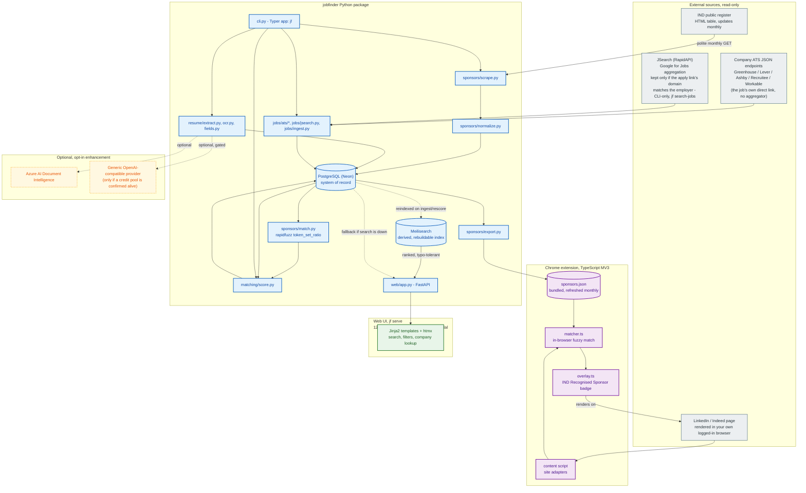
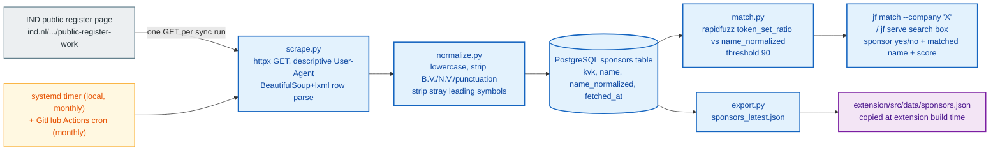

# JobFinder architecture

## What this is

A personal job-search tool for the Dutch market. The core differentiator:
cross-reference companies and job postings against the IND public register
of recognised sponsors (https://ind.nl/en/public-register-recognised-sponsors/public-register-work),
so it's immediately clear which employers can sponsor a work-permit /
highly-skilled-migrant visa. Secondary features: resume OCR and structured
extraction, keyword/experience/country matching, and tracking companies
that accept open applications.

## Stack

- Python owns everything except the browser extension: IND scraping, fuzzy
  sponsor matching, resume OCR/parsing, job ingestion, scoring, CLI, and
  the web UI.
- A CLI (`jf`) and a local web UI (`jf serve`, FastAPI + Jinja2 + htmx)
  both sit on the same backend code - neither duplicates the other's
  logic, they're two views onto `sponsors/match.py` etc.
- TypeScript owns the Chrome extension (Manifest V3) - the only other
  language in the project.
- PostgreSQL (hosted free on [Neon](https://neon.tech), serverless/scale-
  to-zero) for storage - moved off SQLite (2026-10-03) once this stopped
  being strictly single-user-local: Neon gives a real `DATABASE_URL` any
  deployment (Modal or otherwise) can reach, without standing up and
  operating a database server by hand.
- Meilisearch, self-hosted on Modal, for search - a derived, rebuildable
  ranked/typo-tolerant index over the jobs table, never the system of
  record. Not backed by a Modal Volume: a real Meilisearch bug ("failed
  to infer the version of the database") showed up on that filesystem,
  the same category of non-standard-write-durability problem SQLite-on-
  a-Volume had - runs on the container's own local disk instead, which
  is fine since `rescore_jobs()` already reindexes everything as a side
  effect any time it runs.

## Hosting

`jf serve` binds `127.0.0.1` by default for purely local use. Separately,
the app is also deployed on [Modal](https://modal.com) (see `deploy/`),
auto-deploying on every push to `main` via
`.github/workflows/deploy-modal.yml`. The two aren't mutually exclusive:
local-first stays the default for quick local testing, the Modal
deployment is the actually-used, always-reachable instance - see
`deploy/README.md` for the full setup (Postgres via Neon, search via
self-hosted Meilisearch, secrets).

## System architecture

Blue = built (the whole core package, every phase), purple = the Chrome
extension (built), green = the web UI (built), gray = an external source
JobFinder reads from, amber dashed = optional opt-in enhancement (the only
pieces still off by default).

## Sponsor registry sync

Note: the IND page has been seen listing the same KVK number twice; the
upsert (`ON CONFLICT(kvk) DO UPDATE`) collapses that to one row, so
`jf sync-sponsors`'s reported count is distinct sponsors stored, not raw
rows parsed. Also: an earlier version of this matcher used rapidfuzz's
`WRatio` scorer, which turned out to give a false-positive ~90/100 "match"
to almost any short query against a long, unrelated company name (verified
live - it degrades to `partial_ratio * 0.9`, and a short string is
trivially "contained in" almost anything). Switched to `token_set_ratio`,
which separates real matches (90-100) from unrelated pairs (stayed at or
below 57 across every adversarial case tried). See the docstring on
`match_company` for the full reasoning and numbers.

## Risk / legal posture

| Posture | Risk | Guardrail |
| --- | --- | --- |
| IND register scraping | Low - government register published for exactly this lookup purpose; robots.txt allows it; no reuse restriction found | One GET per monthly sync, descriptive User-Agent, abort loudly if row count craters or parsing yields zero rows |
| LinkedIn/Indeed server-side bulk scraping | High - ToS risk, bot-detection fragility, risk to the account doing it | Avoided entirely - job ingestion uses direct ATS JSON endpoints instead, verified live against a real company's public Greenhouse board |
| Job aggregator APIs | Adzuna's terms (developer.adzuna.com/docs/terms_of_service) require a visible "Jobs by Adzuna" badge - conflicts with a clean, direct-to-employer open-source product, tried then dropped | JSearch (RapidAPI, openwebninja.com/terms) checked instead: commercial API-data use is explicitly licensed, no attribution badge required - but its own `job_apply_is_direct` flag turned out not to mean "employer's own domain" (verified live: every one of 10 real results was `false`, including genuine employer career pages), so results are filtered by apply-link-domain-vs-employer-name match (rapidfuzz) instead, CLI-only given the 200 req/month free tier |
| Chrome extension badge overlay | Materially lower - reads only the page already rendered in an authenticated session, same category as an ad blocker | Stays client-side only, no server-side fetch of LinkedIn/Indeed pages. Follows from this: the LinkedIn/Indeed CSS selectors in `extension/src/content/site-adapters/` are best-effort, never verified against a live session - see `extension/README.md` |
| Resume content (PII) | N/A for local-only parsing | Any third-party parsing tier is opt-in only, never default |
| Web UI reachability | N/A while local-only | Defaults to `127.0.0.1`; opening it up is an explicit `--host` choice, see Hosting above |

## Roadmap

All five phases from the original plan are built:

1. **Sponsor registry sync + fuzzy match** - zero external API dependency, the actual differentiator.
2. **CLI + local web UI** - `jf` commands and `jf serve` (FastAPI + Jinja2 + htmx), both backed by the same matching code. Local-only by default; see Hosting above for remote-access options.
3. **Chrome extension badge overlay** - Vite + CRXJS + TypeScript MV3, bundled sponsor snapshot, in-browser `token_set_ratio` port. Verified end-to-end in real Chrome against a simulated LinkedIn navigation; real selectors still need checking against a live session, see `extension/README.md`.
4. **Resume OCR + structured extraction** - `pdfplumber` text layer, per-page `pytesseract`/`pdf2image` OCR fallback (needs the `tesseract` system binary, not just a pip package), heuristic skills/experience/education extraction - no LLM call, no persona-biased keyword list.
5. **Job ingestion + open-application tracking + resume-derived scoring** - direct ATS JSON APIs (verified live against Stripe's real Greenhouse board; Greenhouse/Lever/Ashby/Recruitee/Workable) plus JSearch (CLI-only, filtered to direct-domain results), enriched with sponsor status and an open-application flag at ingest time via `matching/score.py`, generalizing job-research's hardcoded fit_score into resume-derived weights.

Past the original five: **storage migrated from SQLite to PostgreSQL**
(Neon, 2026-10-03), and a **Meilisearch search index** (self-hosted on
Modal) was added on top for ranked, typo-tolerant search - both deployed
alongside the app (see `deploy/README.md`).

Explicitly not built, by design: automatic discovery of which sponsor
uses which ATS/slug (job-research's DuckDuckGo-based approach was
deliberately not repeated - pass a known `--slug` instead), and direct
LinkedIn/Indeed server-side scraping (considered and rejected as the
same ToS-risk category as Adzuna, worse - see Risk posture above).

Full reasoning and the hackathon-credential/job-research research behind
these decisions: `~/.claude/plans/zippy-pondering-scroll.md`.
